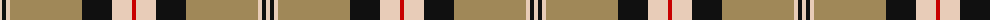
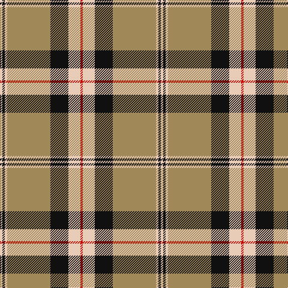

The parent of this is [Unidentified (ex Tony Murray)](/tartans/lr/4/k4/lr4/lt72/k30/lr20/r/4/)

This was sourced from tartans-authority.  It is a [7 stripes tartan](/stripes/stripes7/).

Original link http://www.tartansauthority.com/tartan-ferret/display/8885/

## Thread count
LR/4 K4 LR4 LT72 K30 LR20 R/4

## Palette
Each colour and its ΔE from the base-6 reference it is a variant of.

| Colour | Shade | Base | ΔE (OKLab) |
|---|---|---|---|
| K |  `#101010` | K  | 0.17 |
| LR |  `#E8CCB8` | W  | 0.11 |
| LT |  `#A08858` | Y  | 0.21 |
| R |  `#C80000` | R  | 0.00 |

# Sample pattern

ID: /variants/lr/4/k4/lr4/lt72/k30/lr20/r/4-k101010-lre8ccb8-lta08858-rc80000/
