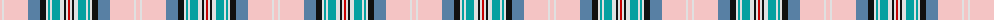

The parent of this is [Diana Pink (Commemorative)](/tartans/lr/4/ln2/lr24/ba12/k6/ln2/b2/ln2/b8/ln4/k2/ln2/r/2/)

This was sourced from tartans-authority.  It is a [13 stripes tartan](/stripes/stripes13/).

Original link http://www.tartansauthority.com/tartan-ferret/display/7955/

## Thread count
LR/4 LN2 LR24 Ba12 K6 LN2 B2 LN2 B8 LN4 K2 LN2 R/2

## Palette
Each colour and its ΔE from the base-6 reference it is a variant of.

| Colour | Shade | Base | ΔE (OKLab) |
|---|---|---|---|
| B |  `#04A0A0` | G  | 0.24 |
| Ba |  `#5880A4` | B  | 0.20 |
| K |  `#101010` | K  | 0.17 |
| LN |  `#E0E0E0` | W  | 0.06 |
| LR |  `#F4C4C4` | W  | 0.12 |
| R |  `#C80000` | R  | 0.00 |

ID: /variants/lr/4/ln2/lr24/ba12/k6/ln2/b2/ln2/b8/ln4/k2/ln2/r/2-b04a0a0-ba5880a4-k101010-lne0e0e0-lrf4c4c4-rc80000/
