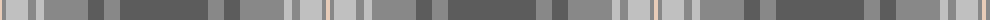

The parent of this is [Titanium (Fashion)](/tartans/lr/4/nb4/na22/nb8/na8/nb44/n16/nb16/n/88/)

This was sourced from tartans-authority.  It is a [9 stripes tartan](/stripes/stripes9/).

Original link http://www.tartansauthority.com/tartan-ferret/display/10818/

## Thread count
LR/4 Nb4 Na22 Nb8 Na8 Nb44 N16 Nb16 N/88

## Palette
Each colour and its ΔE from the base-6 reference it is a variant of.

| Colour | Shade | Base | ΔE (OKLab) |
|---|---|---|---|
| LR |  `#E8CCB8` | W  | 0.11 |
| N |  `#5C5C5C` | B  | 0.14 |
| Na |  `#C0C0C0` | W  | 0.16 |
| Nb |  `#888888` | R  | 0.24 |

ID: /variants/lr/4/nb4/na22/nb8/na8/nb44/n16/nb16/n/88-lre8ccb8-n5c5c5c-nac0c0c0-nb888888/
