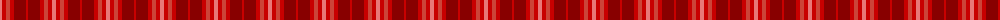
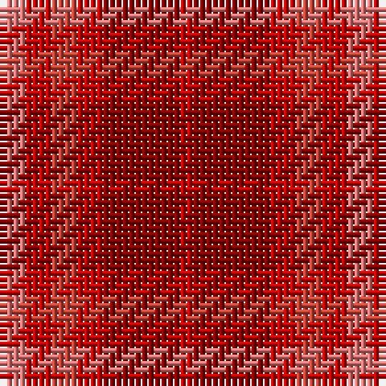

The parent of this is [Youth on The Horizon (Fashion)](/tartans/lr/4/ra4/r4/ra4/dr12/ra/2/)

This was sourced from tartans-authority.  It is a [6 stripes tartan](/stripes/stripes6/).

Original link http://www.tartansauthority.com/tartan-ferret/display/4238/

## Thread count
LR/4 Ra4 R4 Ra4 DR12 Ra/2

## Palette
Each colour and its ΔE from the base-6 reference it is a variant of.

| Colour | Shade | Base | ΔE (OKLab) |
|---|---|---|---|
| DR |  `#880000` | R  | 0.14 |
| LR |  `#E87878` | R  | 0.19 |
| R |  `#CC4438` | R  | 0.07 |
| Ra |  `#C80000` | R  | 0.00 |

# Sample pattern

ID: /variants/lr/4/ra4/r4/ra4/dr12/ra/2-dr880000-lre87878-rcc4438-rac80000/
