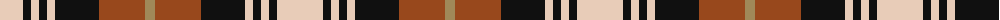

The parent of this is [Aberlour (Corporate)](/tartans/lr/46/k8/lr8/k8/lr8/k44/t46/lt/10/)

This was sourced from tartans-authority.  It is a [8 stripes tartan](/stripes/stripes8/).

Original link http://www.tartansauthority.com/tartan-ferret/display/5982/

## Thread count
LR/46 K8 LR8 K8 LR8 K44 T46 LT/10

## Palette
Each colour and its ΔE from the base-6 reference it is a variant of.

| Colour | Shade | Base | ΔE (OKLab) |
|---|---|---|---|
| K |  `#101010` | K  | 0.17 |
| LR |  `#E8CCB8` | W  | 0.11 |
| LT |  `#A08858` | Y  | 0.21 |
| T |  `#98481C` | R  | 0.11 |

# Sample pattern

ID: /variants/lr/46/k8/lr8/k8/lr8/k44/t46/lt/10-k101010-lre8ccb8-lta08858-t98481c/
