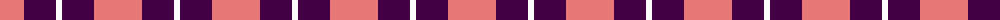
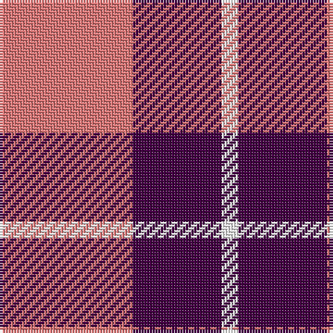

The parent of this is [National Autistic Society Scotland](/tartans/lr/48/dp32/w/6/)

This was sourced from tartans-authority.  It is a [3 stripes tartan](/stripes/stripes3/).

Original link http://www.tartansauthority.com/tartan-ferret/display/10685/

## Thread count
LR/48 DP32 W/6

## Palette
Each colour and its ΔE from the base-6 reference it is a variant of.

| Colour | Shade | Base | ΔE (OKLab) |
|---|---|---|---|
| DP |  `#440044` | B  | 0.17 |
| LR |  `#E87878` | R  | 0.19 |
| W |  `#FCFCFC` | W  | 0.03 |

# Sample pattern

ID: /variants/lr/48/dp32/w/6-dp440044-lre87878-wfcfcfc/
