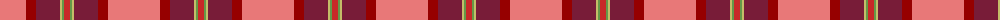

The parent of this is [Roseate Sunrise](/tartans/lr/52/dr10/dra24/lg2/lga2/r/6/)

This was sourced from register-of-tartans.  It is a [6 stripes tartan](/stripes/stripes6/).

Original link https://www.tartanregister.gov.uk/tartanDetails.aspx?ref=11330

## Thread count
LR/52 DR10 DRa24 LG2 LGa2 R/6

## Palette
Each colour and its ΔE from the base-6 reference it is a variant of.

| Colour | Shade | Base | ΔE (OKLab) |
|---|---|---|---|
| DR |  `#960000` | R  | 0.11 |
| DRa |  `#781C38` | R  | 0.17 |
| LG |  `#C4BC68` | Y  | 0.07 |
| LGa |  `#649848` | G  | 0.19 |
| LR |  `#E87878` | R  | 0.19 |
| R |  `#C82828` | R  | 0.03 |

# Sample pattern

ID: /variants/lr/52/dr10/dra24/lg2/lga2/r/6-dr960000-dra781c38-lgc4bc68-lga649848-lre87878-rc82828/
