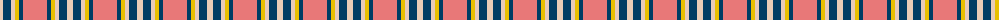

The parent of this is [Winnipeg Embroiders' Guild (Corp.)](/tartans/lr/6/db8/lr4/y4/db4/lra/24/)

This was sourced from tartans-authority.  It is a [6 stripes tartan](/stripes/stripes6/).

Original link http://www.tartansauthority.com/tartan-ferret/display/10758/

## Thread count
LR/6 DB8 LR4 Y4 DB4 LRa/24

## Palette
Each colour and its ΔE from the base-6 reference it is a variant of.

| Colour | Shade | Base | ΔE (OKLab) |
|---|---|---|---|
| DB |  `#003C64` | B  | 0.07 |
| LR |  `#E8CCB8` | W  | 0.11 |
| LRa |  `#E87878` | R  | 0.19 |
| Y |  `#E8C000` | Y  | 0.00 |

# Sample pattern

ID: /variants/lr/6/db8/lr4/y4/db4/lra/24-db003c64-lre8ccb8-lrae87878-ye8c000/
