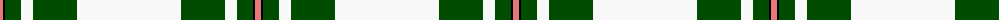

The parent of this is [MacGregor Dress Green (Dance)](/tartans/lr/6/k2/g16/w12/g44/w/104/)

This was sourced from register-of-tartans.  It is a [6 stripes tartan](/stripes/stripes6/).

Original link https://www.tartanregister.gov.uk/tartanDetails.aspx?ref=2453

## Thread count
LR/6 K2 G16 W12 G44 W/104

## Palette
Each colour and its ΔE from the base-6 reference it is a variant of.

| Colour | Shade | Base | ΔE (OKLab) |
|---|---|---|---|
| G |  `#004C00` | G  | 0.08 |
| K |  `#000000` | K  | 0.00 |
| LR |  `#E87878` | R  | 0.19 |
| W |  `#F8F8F8` | W  | 0.01 |

# Sample pattern

ID: /variants/lr/6/k2/g16/w12/g44/w/104-g004c00-k000000-lre87878-wf8f8f8/
