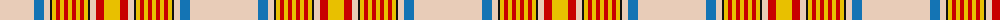

The parent of this is [Espana (District)](/tartans/lr/68/b10/lr6/k2/y4/r4/y4/r4/y4/r4/y4/r4/y4/k2/lr6/r8/y/16/)

This was sourced from tartans-authority.  It is a [17 stripes tartan](/stripes/stripes17/).

Original link http://www.tartansauthority.com/tartan-ferret/display/4824/

## Thread count
LR/68 B10 LR6 K2 Y4 R4 Y4 R4 Y4 R4 Y4 R4 Y4 K2 LR6 R8 Y/16

## Palette
Each colour and its ΔE from the base-6 reference it is a variant of.

| Colour | Shade | Base | ΔE (OKLab) |
|---|---|---|---|
| B |  `#1474B4` | B  | 0.15 |
| K |  `#101010` | K  | 0.17 |
| LR |  `#E8CCB8` | W  | 0.11 |
| R |  `#C80000` | R  | 0.00 |
| Y |  `#E8C000` | Y  | 0.00 |

ID: /variants/lr/68/b10/lr6/k2/y4/r4/y4/r4/y4/r4/y4/r4/y4/k2/lr6/r8/y/16-b1474b4-k101010-lre8ccb8-rc80000-ye8c000/
