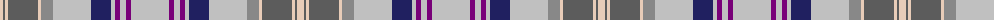

The parent of this is [Lethcoe (Personal)](/tartans/lr/7/n2/lr3/n30/lr3/nb12/na38/db20/na4/p5/na6/p5/na/38/)

This was sourced from tartans-authority.  It is a [13 stripes tartan](/stripes/stripes13/).

Original link http://www.tartansauthority.com/tartan-ferret/display/10813/

## Thread count
LR/7 N2 LR3 N30 LR3 Nb12 Na38 DB20 Na4 P5 Na6 P5 Na/38

## Palette
Each colour and its ΔE from the base-6 reference it is a variant of.

| Colour | Shade | Base | ΔE (OKLab) |
|---|---|---|---|
| DB |  `#202060` | B  | 0.11 |
| LR |  `#E8CCB8` | W  | 0.11 |
| N |  `#5C5C5C` | B  | 0.14 |
| Na |  `#C0C0C0` | W  | 0.16 |
| Nb |  `#888888` | R  | 0.24 |
| P |  `#780078` | B  | 0.16 |

ID: /variants/lr/7/n2/lr3/n30/lr3/nb12/na38/db20/na4/p5/na6/p5/na/38-db202060-lre8ccb8-n5c5c5c-nac0c0c0-nb888888-p780078/
