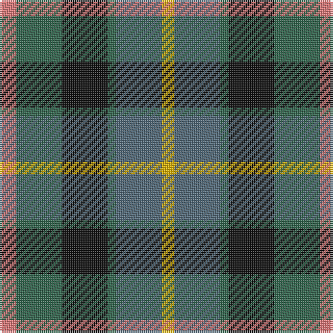

The parent of this is [Casely (Name)](/tartans/lr/8/g22/k22/g4/n22/y/6/)

This was sourced from tartans-authority.  It is a [6 stripes tartan](/stripes/stripes6/).

Original link http://www.tartansauthority.com/tartan-ferret/display/2146/

## Thread count
LR/8 G22 K22 G4 N22 Y/6

## Palette
Each colour and its ΔE from the base-6 reference it is a variant of.

| Colour | Shade | Base | ΔE (OKLab) |
|---|---|---|---|
| G |  `#30644C` | G  | 0.09 |
| K |  `#101010` | K  | 0.17 |
| LR |  `#E87878` | R  | 0.19 |
| N |  `#506878` | B  | 0.14 |
| Y |  `#E0B000` | Y  | 0.04 |

# Sample pattern

ID: /variants/lr/8/g22/k22/g4/n22/y/6-g30644c-k101010-lre87878-n506878-ye0b000/
