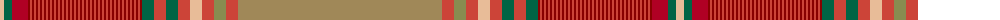

The parent of this is [Collinet (Personal)](/tartans/lr/8/g8/ra16/dr2/r2/dr2/r2/dr2/r2/dr2/r2/dr2/r2/dr2/r2/dr2/r2/dr2/r2/dr2/r2/dr2/r2/dr2/r2/dr2/r2/dr2/r2/dr2/r2/dr2/r2/dr2/r2/dr2/r2/dr2/r2/dr2/r2/dr2/r2/dr2/r2/dr2/r2/dr2/r2/dr2/r2/dr2/r2/dr2/r2/dr2/r2/dr2/r2/dr2/g12/r12/g12/r12/lr12/r12/lta12/r12/lt/204/)

This was sourced from tartans-authority.  It is a [69 stripes tartan](/stripes/stripes69/).

Original link http://www.tartansauthority.com/tartan-ferret/display/8273/

## Thread count
LR/8 G8 Ra16 DR2 R2 DR2 R2 DR2 R2 DR2 R2 DR2 R2 DR2 R2 DR2 R2 DR2 R2 DR2 R2 DR2 R2 DR2 R2 DR2 R2 DR2 R2 DR2 R2 DR2 R2 DR2 R2 DR2 R2 DR2 R2 DR2 R2 DR2 R2 DR2 R2 DR2 R2 DR2 R2 DR2 R2 DR2 R2 DR2 R2 DR2 R2 DR2 R2 DR2 G12 R12 G12 R12 LR12 R12 LTa12 R12 LT/204

## Palette
Each colour and its ΔE from the base-6 reference it is a variant of.

| Colour | Shade | Base | ΔE (OKLab) |
|---|---|---|---|
| DR |  `#880000` | R  | 0.14 |
| G |  `#006444` | G  | 0.07 |
| LR |  `#E8BC98` | Y  | 0.12 |
| LT |  `#A08858` | Y  | 0.21 |
| LTa |  `#888C50` | G  | 0.21 |
| R |  `#CC4438` | R  | 0.07 |
| Ra |  `#B00024` | R  | 0.06 |

ID: /variants/lr/8/g8/ra16/dr2/r2/dr2/r2/dr2/r2/dr2/r2/dr2/r2/dr2/r2/dr2/r2/dr2/r2/dr2/r2/dr2/r2/dr2/r2/dr2/r2/dr2/r2/dr2/r2/dr2/r2/dr2/r2/dr2/r2/dr2/r2/dr2/r2/dr2/r2/dr2/r2/dr2/r2/dr2/r2/dr2/r2/dr2/r2/dr2/r2/dr2/r2/dr2/r2/dr2/g12/r12/g12/r12/lr12/r12/lta12/r12/lt/204-dr880000-g006444-lre8bc98-lta08858-lta888c50-rcc4438-rab00024/
