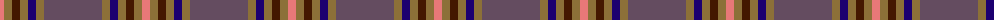
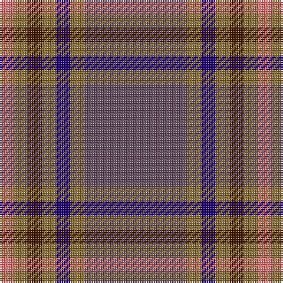

The parent of this is [Marino (Fashion)](/tartans/lr/8/lt8/dr8/lt8/db8/lt8/n/58/)

This was sourced from tartans-authority.  It is a [7 stripes tartan](/stripes/stripes7/).

Original link http://www.tartansauthority.com/tartan-ferret/display/5704/

## Thread count
LR/8 LT8 DR8 LT8 DB8 LT8 N/58

## Palette
Each colour and its ΔE from the base-6 reference it is a variant of.

| Colour | Shade | Base | ΔE (OKLab) |
|---|---|---|---|
| DB |  `#1C0070` | B  | 0.14 |
| DR |  `#441800` | B  | 0.22 |
| LR |  `#E87878` | R  | 0.19 |
| LT |  `#8C7038` | G  | 0.18 |
| N |  `#644C60` | B  | 0.12 |

# Sample pattern

ID: /variants/lr/8/lt8/dr8/lt8/db8/lt8/n/58-db1c0070-dr441800-lre87878-lt8c7038-n644c60/
