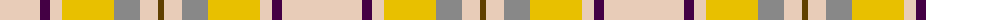

The parent of this is [de Meuron Dress (Family)](/tartans/lr/80/dp10/lr12/y52/n26/lr18/t/6/)

This was sourced from tartans-authority.  It is a [7 stripes tartan](/stripes/stripes7/).

Original link http://www.tartansauthority.com/tartan-ferret/display/10577/

## Thread count
LR/80 DP10 LR12 Y52 N26 LR18 T/6

## Palette
Each colour and its ΔE from the base-6 reference it is a variant of.

| Colour | Shade | Base | ΔE (OKLab) |
|---|---|---|---|
| DP |  `#440044` | B  | 0.17 |
| LR |  `#E8CCB8` | W  | 0.11 |
| N |  `#888888` | R  | 0.24 |
| T |  `#604000` | G  | 0.14 |
| Y |  `#E8C000` | Y  | 0.00 |

# Sample pattern

ID: /variants/lr/80/dp10/lr12/y52/n26/lr18/t/6-dp440044-lre8ccb8-n888888-t604000-ye8c000/
