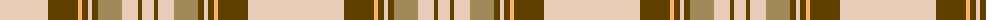

The parent of this is [Loch Skene (Fashion)](/tartans/lr/96/t30/lg4/t6/lr4/t6/lt24/lr16/t4/lr/12/)

This was sourced from tartans-authority.  It is a [10 stripes tartan](/stripes/stripes10/).

Original link http://www.tartansauthority.com/tartan-ferret/display/8973/

## Thread count
LR/96 T30 LG4 T6 LR4 T6 LT24 LR16 T4 LR/12

## Palette
Each colour and its ΔE from the base-6 reference it is a variant of.

| Colour | Shade | Base | ΔE (OKLab) |
|---|---|---|---|
| LG |  `#FCB464` | Y  | 0.08 |
| LR |  `#E8CCB8` | W  | 0.11 |
| LT |  `#A08858` | Y  | 0.21 |
| T |  `#604000` | G  | 0.14 |

ID: /variants/lr/96/t30/lg4/t6/lr4/t6/lt24/lr16/t4/lr/12-lgfcb464-lre8ccb8-lta08858-t604000/
