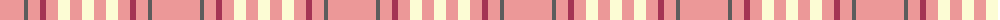

The parent of this is [Weaving for Life](/tartans/lra/48/n4/lra12/dr6/lra12/ly12/lra12/ly/12/)

This was sourced from register-of-tartans.  It is a [8 stripes tartan](/stripes/stripes8/).

Original link https://www.tartanregister.gov.uk/tartanDetails.aspx?ref=4040

## Thread count
LRa/48 N4 LRa12 DR6 LRa12 LY12 LRa12 LY/12

## Palette
Each colour and its ΔE from the base-6 reference it is a variant of.

| Colour | Shade | Base | ΔE (OKLab) |
|---|---|---|---|
| DR |  `#A43454` | R  | 0.10 |
| LR |  `#E09CA0` | Y  | 0.18 |
| LRa |  `#EC9898` | Y  | 0.18 |
| LY |  `#FCFCD4` | W  | 0.05 |
| N |  `#5C5C5C` | B  | 0.14 |

# Sample pattern

ID: /variants/lra/48/n4/lra12/dr6/lra12/ly12/lra12/ly/12-dra43454-lre09ca0-lraec9898-lyfcfcd4-n5c5c5c/
