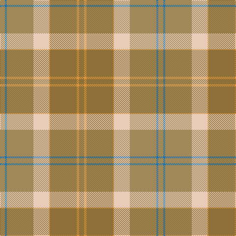

The parent of this is [Cladish (Fashion)](/tartans/lt/10/b4/lt54/lr32/o2/lta54/o5/lta/10/)

This was sourced from tartans-authority.  It is a [8 stripes tartan](/stripes/stripes8/).

Original link http://www.tartansauthority.com/tartan-ferret/display/6011/

## Thread count
LT/10 B4 LT54 LR32 O2 LTa54 O5 LTa/10

## Palette
Each colour and its ΔE from the base-6 reference it is a variant of.

| Colour | Shade | Base | ΔE (OKLab) |
|---|---|---|---|
| B |  `#1474B4` | B  | 0.15 |
| LR |  `#E8CCB8` | W  | 0.11 |
| LT |  `#A08858` | Y  | 0.21 |
| LTa |  `#8C7038` | G  | 0.18 |
| O |  `#DC943C` | Y  | 0.12 |

# Sample pattern

ID: /variants/lt/10/b4/lt54/lr32/o2/lta54/o5/lta/10-b1474b4-lre8ccb8-lta08858-lta8c7038-odc943c/
