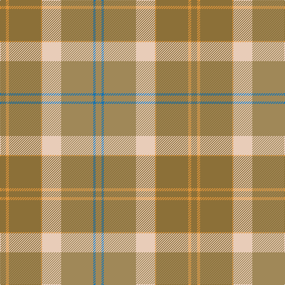

The parent of this is [Cladish](/tartans/lt/10/o5/lt54/o2/lr32/lta54/b4/lta/10/)

This was sourced from register-of-tartans.  It is a [8 stripes tartan](/stripes/stripes8/).

Original link https://www.tartanregister.gov.uk/tartanDetails.aspx?ref=659

## Thread count
LT/10 O5 LT54 O2 LR32 LTa54 B4 LTa/10

## Palette
Each colour and its ΔE from the base-6 reference it is a variant of.

| Colour | Shade | Base | ΔE (OKLab) |
|---|---|---|---|
| B |  `#1474B4` | B  | 0.15 |
| LR |  `#E8CCB8` | W  | 0.11 |
| LT |  `#8C7038` | G  | 0.18 |
| LTa |  `#A08858` | Y  | 0.21 |
| O |  `#DC943C` | Y  | 0.12 |

# Sample pattern

ID: /variants/lt/10/o5/lt54/o2/lr32/lta54/b4/lta/10-b1474b4-lre8ccb8-lt8c7038-ltaa08858-odc943c/
