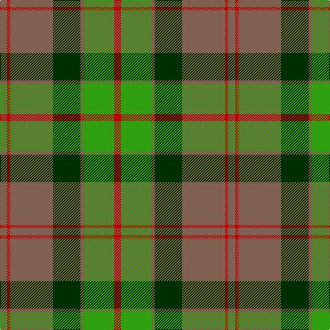

The parent of this is [Ballintrae](/tartans/lt/10/r5/lt62/dg40/lt5/g44/r/10/)

This was sourced from weddslist.  It is a [7 stripes tartan](/stripes/stripes7/).

Original link http://www.weddslist.com/cgi-bin/tartans/pg.pl?source=sts

## Thread count
LT/10 R5 LT62 DG40 LT5 G44 R/10

## Palette
Each colour and its ΔE from the base-6 reference it is a variant of.

| Colour | Shade | Base | ΔE (OKLab) |
|---|---|---|---|
| DG |  `#003000` | G  | 0.18 |
| G |  `#30A010` | G  | 0.19 |
| LT |  `#806050` | R  | 0.17 |
| R |  `#C00000` | R  | 0.02 |

# Sample pattern

ID: /variants/lt/10/r5/lt62/dg40/lt5/g44/r/10-dg003000-g30a010-lt806050-rc00000/
