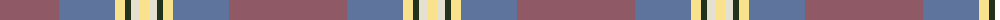
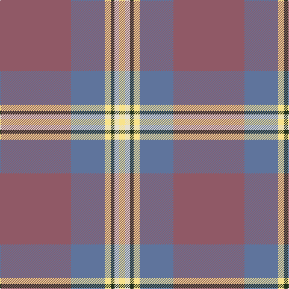

The parent of this is [Dundhuin Gold](/tartans/lt/118/b56/ly10/k6/w8/ly/10/)

This was sourced from register-of-tartans.  It is a [6 stripes tartan](/stripes/stripes6/).

Original link https://www.tartanregister.gov.uk/tartanDetails.aspx?ref=10234

## Thread count
LT/118 B56 LY10 K6 W8 LY/10

## Palette
Each colour and its ΔE from the base-6 reference it is a variant of.

| Colour | Shade | Base | ΔE (OKLab) |
|---|---|---|---|
| B |  `#5F749C` | B  | 0.17 |
| K |  `#23321B` | G  | 0.17 |
| LG |  `#649848` | G  | 0.19 |
| LT |  `#905966` | R  | 0.15 |
| LY |  `#F8E38C` | Y  | 0.11 |
| W |  `#E5E0D2` | W  | 0.06 |

# Sample pattern

ID: /variants/lt/118/b56/ly10/k6/w8/ly/10-b5f749c-k23321b-lg649848-lt905966-lyf8e38c-we5e0d2/
