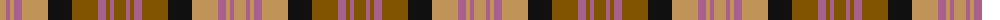

The parent of this is [Glenmorangie (Corporate)](/tartans/lt/12/lp4/lt4/lp8/lt26/k24/t26/lp8/t4/lp4/t/12/)

This was sourced from tartans-authority.  It is a [11 stripes tartan](/stripes/stripes11/).

Original link http://www.tartansauthority.com/tartan-ferret/display/5981/

## Thread count
LT/12 LP4 LT4 LP8 LT26 K24 T26 LP8 T4 LP4 T/12

## Palette
Each colour and its ΔE from the base-6 reference it is a variant of.

| Colour | Shade | Base | ΔE (OKLab) |
|---|---|---|---|
| K |  `#101010` | K  | 0.17 |
| LP |  `#A8608C` | R  | 0.17 |
| LT |  `#C09458` | Y  | 0.15 |
| T |  `#805400` | G  | 0.15 |

ID: /variants/lt/12/lp4/lt4/lp8/lt26/k24/t26/lp8/t4/lp4/t/12-k101010-lpa8608c-ltc09458-t805400/
