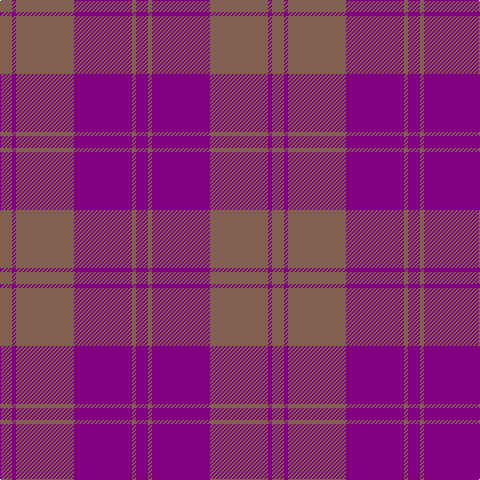

The parent of this is [Harmony, 11](/tartans/lt/12/p4/lt58/p58/lt4/p/12/)

This was sourced from weddslist.  It is a [6 stripes tartan](/stripes/stripes6/).

Original link http://www.weddslist.com/cgi-bin/tartans/pg.pl?source=sts

## Thread count
LT/12 P4 LT58 P58 LT4 P/12

## Palette
Each colour and its ΔE from the base-6 reference it is a variant of.

| Colour | Shade | Base | ΔE (OKLab) |
|---|---|---|---|
| LT |  `#806050` | R  | 0.17 |
| P |  `#800080` | B  | 0.17 |

# Sample pattern

ID: /variants/lt/12/p4/lt58/p58/lt4/p/12-lt806050-p800080/
