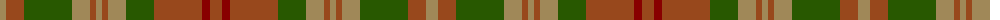

The parent of this is [Pierce (Name)](/tartans/lt/12/t18/g48/lt18/t6/lt6/t6/lt18/g28/t48/dr8/t/12/)

This was sourced from tartans-authority.  It is a [12 stripes tartan](/stripes/stripes12/).

Original link http://www.tartansauthority.com/tartan-ferret/display/4150/

## Thread count
LT/12 T18 G48 LT18 T6 LT6 T6 LT18 G28 T48 DR8 T/12

## Palette
Each colour and its ΔE from the base-6 reference it is a variant of.

| Colour | Shade | Base | ΔE (OKLab) |
|---|---|---|---|
| DR |  `#880000` | R  | 0.14 |
| G |  `#285800` | G  | 0.04 |
| LT |  `#A08858` | Y  | 0.21 |
| T |  `#98481C` | R  | 0.11 |

ID: /variants/lt/12/t18/g48/lt18/t6/lt6/t6/lt18/g28/t48/dr8/t/12-dr880000-g285800-lta08858-t98481c/
