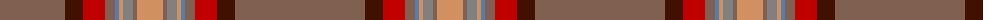

The parent of this is [Down](/tartans/lt/130/dr18/r22/lt10/b4/o4/n10/lt4/o/26/)

This was sourced from weddslist.  It is a [9 stripes tartan](/stripes/stripes9/).

Original link http://www.weddslist.com/cgi-bin/tartans/pg.pl?source=sts

## Thread count
LT/130 DR18 R22 LT10 B4 O4 N10 LT4 O/26

## Palette
Each colour and its ΔE from the base-6 reference it is a variant of.

| Colour | Shade | Base | ΔE (OKLab) |
|---|---|---|---|
| B |  `#5480B0` | B  | 0.20 |
| DR |  `#401000` | B  | 0.23 |
| LT |  `#806050` | R  | 0.17 |
| N |  `#808080` | G  | 0.22 |
| O |  `#D09060` | Y  | 0.15 |
| R |  `#C00000` | R  | 0.02 |

ID: /variants/lt/130/dr18/r22/lt10/b4/o4/n10/lt4/o/26-b5480b0-dr401000-lt806050-n808080-od09060-rc00000/
