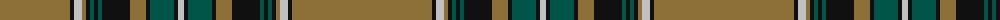

The parent of this is [Wcwm 9275-1415](/tartans/lt/140/k4/n8/lt4/k4/g4/k4/g4/k28/lt16/k4/g24/k4/n/6/)

This was sourced from register-of-tartans.  It is a [14 stripes tartan](/stripes/stripes14/).

Original link https://www.tartanregister.gov.uk/tartanDetails.aspx?ref=4564

## Thread count
LT/140 K4 N8 LT4 K4 G4 K4 G4 K28 LT16 K4 G24 K4 N/6

## Palette
Each colour and its ΔE from the base-6 reference it is a variant of.

| Colour | Shade | Base | ΔE (OKLab) |
|---|---|---|---|
| G |  `#005448` | G  | 0.11 |
| K |  `#101010` | K  | 0.17 |
| LT |  `#8C7038` | G  | 0.18 |
| N |  `#C0C0C0` | W  | 0.16 |

ID: /variants/lt/140/k4/n8/lt4/k4/g4/k4/g4/k28/lt16/k4/g24/k4/n/6-g005448-k101010-lt8c7038-nc0c0c0/
