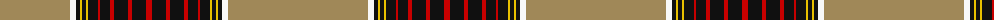

The parent of this is [Desert (Fashion)](/tartans/lt/140/w6/k4/y2/k4/y2/k10/r2/k10/r4/k14/r4/k14/r/6/)

This was sourced from tartans-authority.  It is a [14 stripes tartan](/stripes/stripes14/).

Original link http://www.tartansauthority.com/tartan-ferret/display/7055/

## Thread count
LT/140 W6 K4 Y2 K4 Y2 K10 R2 K10 R4 K14 R4 K14 R/6

## Palette
Each colour and its ΔE from the base-6 reference it is a variant of.

| Colour | Shade | Base | ΔE (OKLab) |
|---|---|---|---|
| K |  `#101010` | K  | 0.17 |
| LT |  `#A08858` | Y  | 0.21 |
| R |  `#C80000` | R  | 0.00 |
| W |  `#F8F8F8` | W  | 0.01 |
| Y |  `#E8C000` | Y  | 0.00 |

ID: /variants/lt/140/w6/k4/y2/k4/y2/k10/r2/k10/r4/k14/r4/k14/r/6-k101010-lta08858-rc80000-wf8f8f8-ye8c000/
