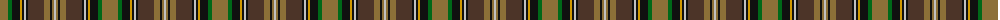

The parent of this is [Wcwm 9275-1258](/tartans/lt/16/g4/k8/dy2/k2/n2/k2/t16/lt6/k2/lt2/n/2/)

This was sourced from register-of-tartans.  It is a [12 stripes tartan](/stripes/stripes12/).

Original link https://www.tartanregister.gov.uk/tartanDetails.aspx?ref=4557

## Thread count
LT/16 G4 K8 DY2 K2 N2 K2 T16 LT6 K2 LT2 N/2

## Palette
Each colour and its ΔE from the base-6 reference it is a variant of.

| Colour | Shade | Base | ΔE (OKLab) |
|---|---|---|---|
| DY |  `#D09800` | Y  | 0.11 |
| G |  `#006818` | G  | 0.02 |
| K |  `#101010` | K  | 0.17 |
| LT |  `#8C7038` | G  | 0.18 |
| N |  `#C0C0C0` | W  | 0.16 |
| T |  `#4C3428` | B  | 0.16 |

ID: /variants/lt/16/g4/k8/dy2/k2/n2/k2/t16/lt6/k2/lt2/n/2-dyd09800-g006818-k101010-lt8c7038-nc0c0c0-t4c3428/
