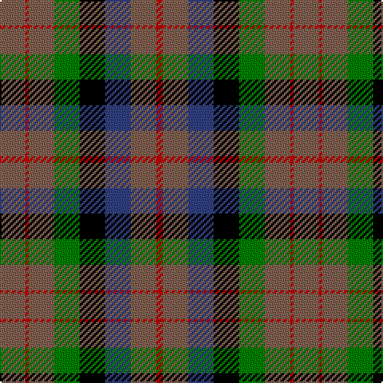

The parent of this is [MacDuff, hunting](/tartans/lt/16/r2/lt16/g16/k16/b16/lt16/r/4/)

This was sourced from weddslist.  It is a [8 stripes tartan](/stripes/stripes8/).

Original link http://www.weddslist.com/cgi-bin/tartans/pg.pl?source=sts

## Thread count
LT/16 R2 LT16 G16 K16 B16 LT16 R/4

## Palette
Each colour and its ΔE from the base-6 reference it is a variant of.

| Colour | Shade | Base | ΔE (OKLab) |
|---|---|---|---|
| B |  `#304080` | B  | 0.01 |
| G |  `#008000` | G  | 0.09 |
| K |  `#000000` | K  | 0.00 |
| LT |  `#806050` | R  | 0.17 |
| R |  `#C00000` | R  | 0.02 |

# Sample pattern

ID: /variants/lt/16/r2/lt16/g16/k16/b16/lt16/r/4-b304080-g008000-k000000-lt806050-rc00000/
