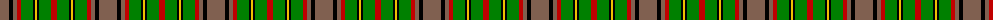

The parent of this is [MacAart](/tartans/lt/18/k4/lt4/r4/g12/k2/y2/k2/g12/r/6/)

This was sourced from weddslist.  It is a [10 stripes tartan](/stripes/stripes10/).

Original link http://www.weddslist.com/cgi-bin/tartans/pg.pl?source=sts

## Thread count
LT/18 K4 LT4 R4 G12 K2 Y2 K2 G12 R/6

## Palette
Each colour and its ΔE from the base-6 reference it is a variant of.

| Colour | Shade | Base | ΔE (OKLab) |
|---|---|---|---|
| G |  `#008000` | G  | 0.09 |
| K |  `#000000` | K  | 0.00 |
| LT |  `#806050` | R  | 0.17 |
| R |  `#C00000` | R  | 0.02 |
| Y |  `#F0C000` | Y  | 0.01 |

ID: /variants/lt/18/k4/lt4/r4/g12/k2/y2/k2/g12/r/6-g008000-k000000-lt806050-rc00000-yf0c000/
