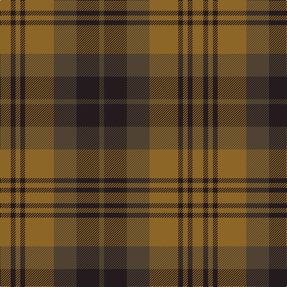

The parent of this is [Chindecella Gorse (Kemete Heil)](/tartans/lt/18/k8/lt8/k8/lt48/t38/k38/t/8/)

This was sourced from register-of-tartans.  It is a [8 stripes tartan](/stripes/stripes8/).

Original link https://www.tartanregister.gov.uk/tartanDetails.aspx?ref=10254

## Thread count
LT/18 K8 LT8 K8 LT48 T38 K38 T/8

## Palette
Each colour and its ΔE from the base-6 reference it is a variant of.

| Colour | Shade | Base | ΔE (OKLab) |
|---|---|---|---|
| K |  `#241B1E` | B  | 0.20 |
| LT |  `#8C6627` | R  | 0.17 |
| T |  `#4F4232` | B  | 0.15 |

# Sample pattern

ID: /variants/lt/18/k8/lt8/k8/lt48/t38/k38/t/8-k241b1e-lt8c6627-t4f4232/
