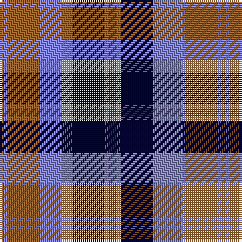

The parent of this is [Over Mountain](/tartans/lt/2/b2/lt16/b16/db16/b2/r/4/)

This was sourced from weddslist.  It is a [7 stripes tartan](/stripes/stripes7/).

Original link http://www.weddslist.com/cgi-bin/tartans/pg.pl?source=sts

## Thread count
LT/2 B2 LT16 B16 DB16 B2 R/4

## Palette
Each colour and its ΔE from the base-6 reference it is a variant of.

| Colour | Shade | Base | ΔE (OKLab) |
|---|---|---|---|
| B |  `#8080D0` | B  | 0.24 |
| DB |  `#000050` | B  | 0.20 |
| LT |  `#906030` | R  | 0.15 |
| R |  `#C00000` | R  | 0.02 |

# Sample pattern

ID: /variants/lt/2/b2/lt16/b16/db16/b2/r/4-b8080d0-db000050-lt906030-rc00000/
