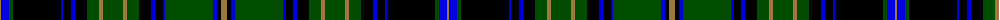

The parent of this is [Wcwm 1538](/tartans/lt/2/b8/g4/k48/b2/k8/b4/k12/g12/lt4/g20/lt4/g12/k12/b4/k8/b2/g48/b4/k4/lt/6/)

This was sourced from register-of-tartans.  It is a [21 stripes tartan](/stripes/stripes21/).

Original link https://www.tartanregister.gov.uk/tartanDetails.aspx?ref=4529

## Thread count
LT/2 B8 G4 K48 B2 K8 B4 K12 G12 LT4 G20 LT4 G12 K12 B4 K8 B2 G48 B4 K4 LT/6

## Palette
Each colour and its ΔE from the base-6 reference it is a variant of.

| Colour | Shade | Base | ΔE (OKLab) |
|---|---|---|---|
| B |  `#0000E0` | B  | 0.17 |
| G |  `#004C00` | G  | 0.08 |
| K |  `#000000` | K  | 0.00 |
| LT |  `#A0783C` | R  | 0.18 |

ID: /variants/lt/2/b8/g4/k48/b2/k8/b4/k12/g12/lt4/g20/lt4/g12/k12/b4/k8/b2/g48/b4/k4/lt/6-b0000e0-g004c00-k000000-lta0783c/
