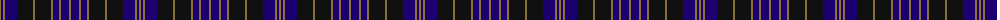

The parent of this is [Clergy (WCWM)](/tartans/lt/2/db2/lt2/db12/k16/lt2/k16/lt2/db6/lt2/db8/lt/2/)

This was sourced from register-of-tartans.  It is a [12 stripes tartan](/stripes/stripes12/).

Original link https://www.tartanregister.gov.uk/tartanDetails.aspx?ref=683

## Thread count
LT/2 DB2 LT2 DB12 K16 LT2 K16 LT2 DB6 LT2 DB8 LT/2

## Palette
Each colour and its ΔE from the base-6 reference it is a variant of.

| Colour | Shade | Base | ΔE (OKLab) |
|---|---|---|---|
| DB |  `#1C0070` | B  | 0.14 |
| K |  `#101010` | K  | 0.17 |
| LT |  `#8C7038` | G  | 0.18 |

ID: /variants/lt/2/db2/lt2/db12/k16/lt2/k16/lt2/db6/lt2/db8/lt/2-db1c0070-k101010-lt8c7038/
