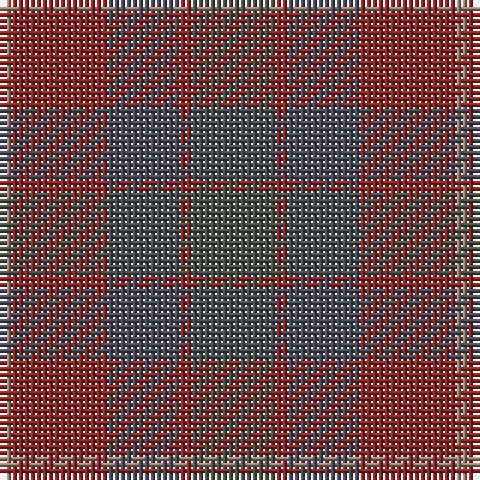

The parent of this is [Callum (Buchan)](/tartans/lt/2/dr16/n12/dr2/na/14/)

This was sourced from register-of-tartans.  It is a [5 stripes tartan](/stripes/stripes5/).

Original link https://www.tartanregister.gov.uk/tartanDetails.aspx?ref=10322

## Thread count
LT/2 DR16 N12 DR2 Na/14

## Palette
Each colour and its ΔE from the base-6 reference it is a variant of.

| Colour | Shade | Base | ΔE (OKLab) |
|---|---|---|---|
| DR |  `#8C2828` | R  | 0.12 |
| LT |  `#A07D73` | R  | 0.19 |
| N |  `#4B4B58` | B  | 0.10 |
| Na |  `#4B4F4B` | B  | 0.12 |

# Sample pattern

ID: /variants/lt/2/dr16/n12/dr2/na/14-dr8c2828-lta07d73-n4b4b58-na4b4f4b/
