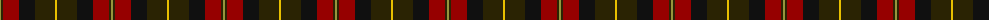
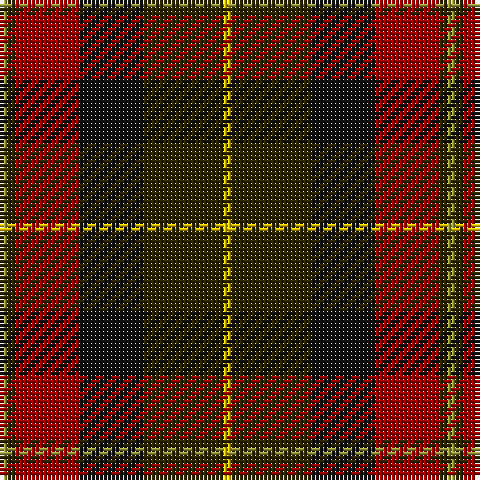

The parent of this is [Unidentified #66](/tartans/lt/2/k2/dr16/ka16/k20/y/2/)

This was sourced from register-of-tartans.  It is a [6 stripes tartan](/stripes/stripes6/).

Original link https://www.tartanregister.gov.uk/tartanDetails.aspx?ref=5312

## Thread count
LT/2 K2 DR16 Ka16 K20 Y/2

## Palette
Each colour and its ΔE from the base-6 reference it is a variant of.

| Colour | Shade | Base | ΔE (OKLab) |
|---|---|---|---|
| DR |  `#960000` | R  | 0.11 |
| K |  `#2A2303` | B  | 0.21 |
| Ka |  `#101010` | K  | 0.17 |
| LT |  `#96963C` | Y  | 0.18 |
| Y |  `#E8C000` | Y  | 0.00 |

# Sample pattern

ID: /variants/lt/2/k2/dr16/ka16/k20/y/2-dr960000-k2a2303-ka101010-lt96963c-ye8c000/
