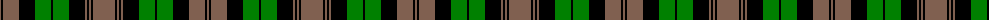

The parent of this is [Brown, Watch](/tartans/lt/2/k2/lt16/k16/g16/k2/g16/k16/lt2/k2/lt2/k2/lt/22/)

This was sourced from weddslist.  It is a [13 stripes tartan](/stripes/stripes13/).

Original link http://www.weddslist.com/cgi-bin/tartans/pg.pl?source=sts

## Thread count
LT/2 K2 LT16 K16 G16 K2 G16 K16 LT2 K2 LT2 K2 LT/22

## Palette
Each colour and its ΔE from the base-6 reference it is a variant of.

| Colour | Shade | Base | ΔE (OKLab) |
|---|---|---|---|
| G |  `#008000` | G  | 0.09 |
| K |  `#000000` | K  | 0.00 |
| LT |  `#806050` | R  | 0.17 |

ID: /variants/lt/2/k2/lt16/k16/g16/k2/g16/k16/lt2/k2/lt2/k2/lt/22-g008000-k000000-lt806050/
