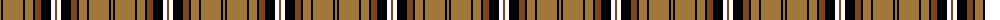

The parent of this is [Braemar, Camel](/tartans/lt/2/k2/lt20/k2/lt8/k2/t6/k10/w4/t/2/)

This was sourced from register-of-tartans.  It is a [10 stripes tartan](/stripes/stripes10/).

Original link https://www.tartanregister.gov.uk/tartanDetails.aspx?ref=5394

## Thread count
LT/2 K2 LT20 K2 LT8 K2 T6 K10 W4 T/2

## Palette
Each colour and its ΔE from the base-6 reference it is a variant of.

| Colour | Shade | Base | ΔE (OKLab) |
|---|---|---|---|
| K |  `#000000` | K  | 0.00 |
| LT |  `#A0783C` | R  | 0.18 |
| T |  `#7C4420` | R  | 0.15 |
| W |  `#FFFFFF` | W  | 0.03 |

ID: /variants/lt/2/k2/lt20/k2/lt8/k2/t6/k10/w4/t/2-k000000-lta0783c-t7c4420-wffffff/
