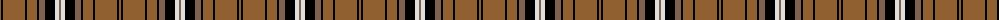

The parent of this is [Braemar, or Blair Atholl](/tartans/lt/2/k2/lt22/k2/lt10/k2/lta6/k10/ln4/lta/2/)

This was sourced from weddslist.  It is a [10 stripes tartan](/stripes/stripes10/).

Original link http://www.weddslist.com/cgi-bin/tartans/pg.pl?source=sts

## Thread count
LT/2 K2 LT22 K2 LT10 K2 LTa6 K10 LN4 LTa/2

## Palette
Each colour and its ΔE from the base-6 reference it is a variant of.

| Colour | Shade | Base | ΔE (OKLab) |
|---|---|---|---|
| K |  `#000000` | K  | 0.00 |
| LN |  `#E0E0E0` | W  | 0.06 |
| LT |  `#906030` | R  | 0.15 |
| LTa |  `#806050` | R  | 0.17 |

ID: /variants/lt/2/k2/lt22/k2/lt10/k2/lta6/k10/ln4/lta/2-k000000-lne0e0e0-lt906030-lta806050/
