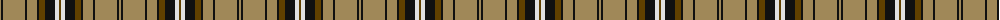

The parent of this is [Braemar or Blair Atholl Trade Tartan Tartan Number: 1741. Earliest known date: 1984 Nothing See products available Copyright © Blair Urquhart, Comrie, 2015](/tartans/lt/2/k2/lt22/k2/lt10/k2/t6/k10/ln4/t/2/)

This was sourced from house-of-tartan.  It is a [10 stripes tartan](/stripes/stripes10/).

Original link http://www.house-of-tartan.scotland.net/house/TartanViewjs.asp?colr=Def&tnam=1741

## Thread count
LT/2 K2 LT22 K2 LT10 K2 T6 K10 LN4 T/2

## Palette
Each colour and its ΔE from the base-6 reference it is a variant of.

| Colour | Shade | Base | ΔE (OKLab) |
|---|---|---|---|
| K |  `#101010` | K  | 0.17 |
| LN |  `#E0E0E0` | W  | 0.06 |
| LT |  `#A08858` | Y  | 0.21 |
| T |  `#604000` | G  | 0.14 |

ID: /variants/lt/2/k2/lt22/k2/lt10/k2/t6/k10/ln4/t/2-k101010-lne0e0e0-lta08858-t604000/
