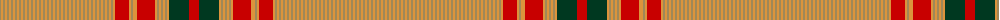

The parent of this is [Unidentified (2013)](/tartans/lt/2/o2/lt2/o2/lt2/o2/lt2/o2/lt2/o2/lt2/o2/lt2/o2/lt2/o2/lt2/o2/lt2/o2/lt2/o2/lt2/o2/lt2/o2/lt2/o2/lt2/o2/lt2/o2/lt2/o2/lt2/o2/lt2/o2/lt2/o2/lt2/o2/lt2/o2/lt2/o2/lt2/o2/lt2/o2/lt2/o2/lt2/o2/lt2/o2/lt2/o2/r14/o2/lt2/o2/o2/r18/o2/lt2/o2/lt2/o2/lt2/o2/dg20/r/10/)

This was sourced from tartans-authority.  It is a [73 stripes tartan](/stripes/stripes73/).

Original link http://www.tartansauthority.com/tartan-ferret/display/8689/

## Thread count
LT/2 O2 LT2 O2 LT2 O2 LT2 O2 LT2 O2 LT2 O2 LT2 O2 LT2 O2 LT2 O2 LT2 O2 LT2 O2 LT2 O2 LT2 O2 LT2 O2 LT2 O2 LT2 O2 LT2 O2 LT2 O2 LT2 O2 LT2 O2 LT2 O2 LT2 O2 LT2 O2 LT2 O2 LT2 O2 LT2 O2 LT2 O2 LT2 O2 LT2 O2 R14 O2 LT2 O2 O2 R18 O2 LT2 O2 LT2 O2 LT2 O2 DG20 R/10

## Palette
Each colour and its ΔE from the base-6 reference it is a variant of.

| Colour | Shade | Base | ΔE (OKLab) |
|---|---|---|---|
| DG |  `#003820` | G  | 0.16 |
| LT |  `#A08858` | Y  | 0.21 |
| O |  `#DC943C` | Y  | 0.12 |
| R |  `#C80000` | R  | 0.00 |

ID: /variants/lt/2/o2/lt2/o2/lt2/o2/lt2/o2/lt2/o2/lt2/o2/lt2/o2/lt2/o2/lt2/o2/lt2/o2/lt2/o2/lt2/o2/lt2/o2/lt2/o2/lt2/o2/lt2/o2/lt2/o2/lt2/o2/lt2/o2/lt2/o2/lt2/o2/lt2/o2/lt2/o2/lt2/o2/lt2/o2/lt2/o2/lt2/o2/lt2/o2/lt2/o2/r14/o2/lt2/o2/o2/r18/o2/lt2/o2/lt2/o2/lt2/o2/dg20/r/10-dg003820-lta08858-odc943c-rc80000/
