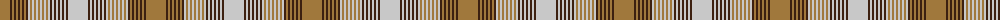

The parent of this is [Wcwm 1131](/tartans/lt/20/k2/lt2/k2/lt2/k2/lt2/k2/lt2/k2/n2/lt2/n2/lt2/n2/lt2/n2/lt2/n2/lt2/n2/k2/n2/k2/n2/k2/n2/k2/n2/k2/n/20/)

This was sourced from register-of-tartans.  It is a [31 stripes tartan](/stripes/stripes31/).

Original link https://www.tartanregister.gov.uk/tartanDetails.aspx?ref=4511

## Thread count
LT/20 K2 LT2 K2 LT2 K2 LT2 K2 LT2 K2 N2 LT2 N2 LT2 N2 LT2 N2 LT2 N2 LT2 N2 K2 N2 K2 N2 K2 N2 K2 N2 K2 N/20

## Palette
Each colour and its ΔE from the base-6 reference it is a variant of.

| Colour | Shade | Base | ΔE (OKLab) |
|---|---|---|---|
| K |  `#3C2010` | B  | 0.20 |
| LT |  `#A0783C` | R  | 0.18 |
| N |  `#C8C8C8` | W  | 0.13 |

ID: /variants/lt/20/k2/lt2/k2/lt2/k2/lt2/k2/lt2/k2/n2/lt2/n2/lt2/n2/lt2/n2/lt2/n2/lt2/n2/k2/n2/k2/n2/k2/n2/k2/n2/k2/n/20-k3c2010-lta0783c-nc8c8c8/
