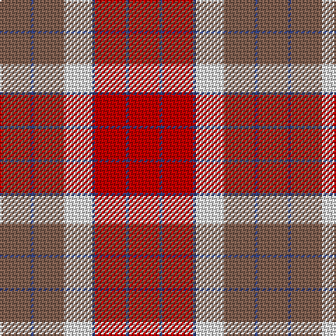

The parent of this is [St Andrews](/tartans/lt/22/b2/lt22/ln20/b2/r22/b2/r/22/)

This was sourced from weddslist.  It is a [8 stripes tartan](/stripes/stripes8/).

Original link http://www.weddslist.com/cgi-bin/tartans/pg.pl?source=sts

## Thread count
LT/22 B2 LT22 LN20 B2 R22 B2 R/22

## Palette
Each colour and its ΔE from the base-6 reference it is a variant of.

| Colour | Shade | Base | ΔE (OKLab) |
|---|---|---|---|
| B |  `#304080` | B  | 0.01 |
| LN |  `#E0E0E0` | W  | 0.06 |
| LT |  `#806050` | R  | 0.17 |
| R |  `#C00000` | R  | 0.02 |

# Sample pattern

ID: /variants/lt/22/b2/lt22/ln20/b2/r22/b2/r/22-b304080-lne0e0e0-lt806050-rc00000/
