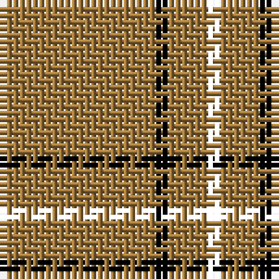

The parent of this is [Lochcarron, Camel (Fashion)](/tartans/lt/24/k2/lta4/lt2/r/2/)

This was sourced from tartans-authority.  It is a [5 stripes tartan](/stripes/stripes5/).

Original link http://www.tartansauthority.com/tartan-ferret/display/5461/

## Thread count
LT/24 K2 LTa4 LT2 R/2

## Palette
Each colour and its ΔE from the base-6 reference it is a variant of.

| Colour | Shade | Base | ΔE (OKLab) |
|---|---|---|---|
| K |  `#000000` | K  | 0.00 |
| LT |  `#A0783C` | R  | 0.18 |
| LTa |  `#A0783C` | R  | 0.18 |

# Sample pattern

ID: /variants/lt/24/k2/lta4/lt2/r/2-k000000-lta0783c-ltaa0783c/
