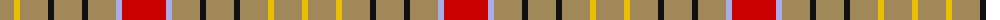

The parent of this is [Sutherland of Duffus](/tartans/lt/28/y6/lt28/k6/lt28/k6/lt28/lp6/r44/lp6/lt28/k6/lt28/k6/lt28/y6/lt28/y/6/)

This was sourced from register-of-tartans.  It is a [18 stripes tartan](/stripes/stripes18/).

Original link https://www.tartanregister.gov.uk/tartanDetails.aspx?ref=5355

## Thread count
LT/28 Y6 LT28 K6 LT28 K6 LT28 LP6 R44 LP6 LT28 K6 LT28 K6 LT28 Y6 LT28 Y/6

## Palette
Each colour and its ΔE from the base-6 reference it is a variant of.

| Colour | Shade | Base | ΔE (OKLab) |
|---|---|---|---|
| K |  `#101010` | K  | 0.17 |
| LP |  `#A8ACE8` | W  | 0.22 |
| LT |  `#A08858` | Y  | 0.21 |
| R |  `#C80000` | R  | 0.00 |
| Y |  `#E8C000` | Y  | 0.00 |

ID: /variants/lt/28/y6/lt28/k6/lt28/k6/lt28/lp6/r44/lp6/lt28/k6/lt28/k6/lt28/y6/lt28/y/6-k101010-lpa8ace8-lta08858-rc80000-ye8c000/
