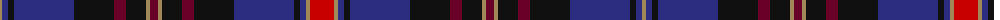

The parent of this is [KPGM Corporate Tartan Tartan Number: 2287. Earliest known date: 1996 Designed by Polly Wittering of House of Edgar for KPMG the international accountancy firm. KPMG International Cooperative ("KPMG International") is a Swiss entity. See products available Copyright © Blair Urquhart, Comrie, 2015](/tartans/lt/4/db6/k6/db60/k40/dr12/k20/lt4/dr8/lt4/k20/dr12/k40/db60/k6/db6/lt4/r/24/)

This was sourced from house-of-tartan.  It is a [18 stripes tartan](/stripes/stripes18/).

Original link http://www.house-of-tartan.scotland.net/house/TartanViewjs.asp?colr=Def&tnam=2287

## Thread count
LT/4 DB6 K6 DB60 K40 DR12 K20 LT4 DR8 LT4 K20 DR12 K40 DB60 K6 DB6 LT4 R/24

## Palette
Each colour and its ΔE from the base-6 reference it is a variant of.

| Colour | Shade | Base | ΔE (OKLab) |
|---|---|---|---|
| DB |  `#2C2C80` | B  | 0.05 |
| DR |  `#680028` | B  | 0.20 |
| K |  `#101010` | K  | 0.17 |
| LT |  `#A08858` | Y  | 0.21 |
| R |  `#C80000` | R  | 0.00 |

ID: /variants/lt/4/db6/k6/db60/k40/dr12/k20/lt4/dr8/lt4/k20/dr12/k40/db60/k6/db6/lt4/r/24-db2c2c80-dr680028-k101010-lta08858-rc80000/
