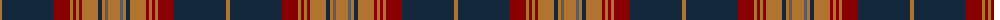

The parent of this is [Drumbeg](/tartans/lt/4/dn52/dr16/lt3/dr3/lt3/dr3/lt16/dn4/lt3/n3/lt/12/)

This was sourced from register-of-tartans.  It is a [12 stripes tartan](/stripes/stripes12/).

Original link https://www.tartanregister.gov.uk/tartanDetails.aspx?ref=978

## Thread count
LT/4 DN52 DR16 LT3 DR3 LT3 DR3 LT16 DN4 LT3 N3 LT/12

## Palette
Each colour and its ΔE from the base-6 reference it is a variant of.

| Colour | Shade | Base | ΔE (OKLab) |
|---|---|---|---|
| DN |  `#14283C` | B  | 0.14 |
| DR |  `#880000` | R  | 0.14 |
| LT |  `#B07430` | R  | 0.17 |
| N |  `#5C5C5C` | B  | 0.14 |

ID: /variants/lt/4/dn52/dr16/lt3/dr3/lt3/dr3/lt16/dn4/lt3/n3/lt/12-dn14283c-dr880000-ltb07430-n5c5c5c/
