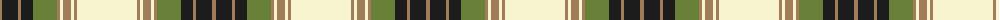

The parent of this is [Ben Ledi (Fashion)](/tartans/lt/4/k16/lt3/k12/g24/lt3/ly3/lt8/ly3/lt3/ly/60/)

This was sourced from tartans-authority.  It is a [11 stripes tartan](/stripes/stripes11/).

Original link http://www.tartansauthority.com/tartan-ferret/display/3676/

## Thread count
LT/4 K16 LT3 K12 G24 LT3 LY3 LT8 LY3 LT3 LY/60

## Palette
Each colour and its ΔE from the base-6 reference it is a variant of.

| Colour | Shade | Base | ΔE (OKLab) |
|---|---|---|---|
| G |  `#688038` | G  | 0.14 |
| K |  `#1C1C1C` | B  | 0.20 |
| LT |  `#A07C58` | R  | 0.19 |
| LY |  `#F8F4D0` | W  | 0.04 |

ID: /variants/lt/4/k16/lt3/k12/g24/lt3/ly3/lt8/ly3/lt3/ly/60-g688038-k1c1c1c-lta07c58-lyf8f4d0/
