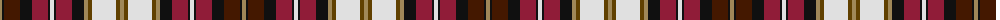

The parent of this is [Dunkeld](/tartans/lt/4/k2/dr16/k12/dra16/k2/ln4/k2/dra16/k12/lt4/t4/ln24/t4/lt/4/)

This was sourced from register-of-tartans.  It is a [15 stripes tartan](/stripes/stripes15/).

Original link https://www.tartanregister.gov.uk/tartanDetails.aspx?ref=1044

## Thread count
LT/4 K2 DR16 K12 DRa16 K2 LN4 K2 DRa16 K12 LT4 T4 LN24 T4 LT/4

## Palette
Each colour and its ΔE from the base-6 reference it is a variant of.

| Colour | Shade | Base | ΔE (OKLab) |
|---|---|---|---|
| DR |  `#441800` | B  | 0.22 |
| DRa |  `#901C38` | R  | 0.12 |
| K |  `#101010` | K  | 0.17 |
| LN |  `#E0E0E0` | W  | 0.06 |
| LT |  `#A08858` | Y  | 0.21 |
| T |  `#604000` | G  | 0.14 |

ID: /variants/lt/4/k2/dr16/k12/dra16/k2/ln4/k2/dra16/k12/lt4/t4/ln24/t4/lt/4-dr441800-dra901c38-k101010-lne0e0e0-lta08858-t604000/
