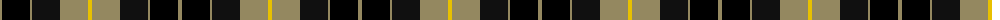
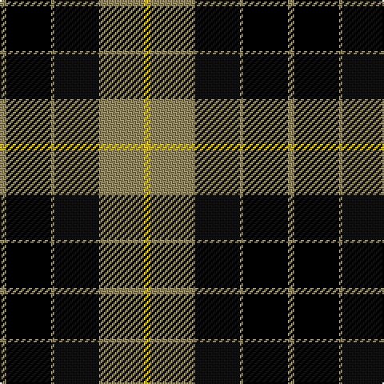

The parent of this is [United Distillers (Corporate)](/tartans/lt/4/k28/lt2/ka28/lt28/y/4/)

This was sourced from tartans-authority.  It is a [6 stripes tartan](/stripes/stripes6/).

Original link http://www.tartansauthority.com/tartan-ferret/display/2098/

## Thread count
LT/4 K28 LT2 Ka28 LT28 Y/4

## Palette
Each colour and its ΔE from the base-6 reference it is a variant of.

| Colour | Shade | Base | ΔE (OKLab) |
|---|---|---|---|
| DB |  `#2C2C80` | B  | 0.05 |
| G |  `#006818` | G  | 0.02 |
| K |  `#000000` | K  | 0.00 |
| Ka |  `#101010` | K  | 0.17 |
| LT |  `#948860` | Y  | 0.22 |
| Y |  `#E8C000` | Y  | 0.00 |

# Sample pattern

ID: /variants/lt/4/k28/lt2/ka28/lt28/y/4-db2c2c80-g006818-k000000-ka101010-lt948860-ye8c000/
